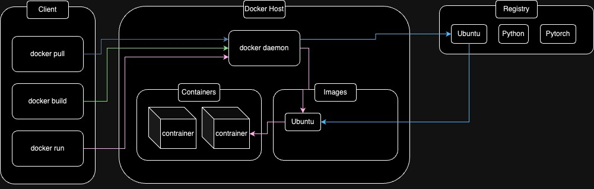
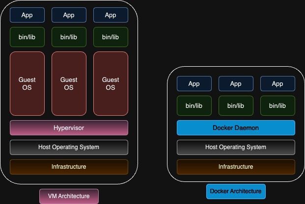
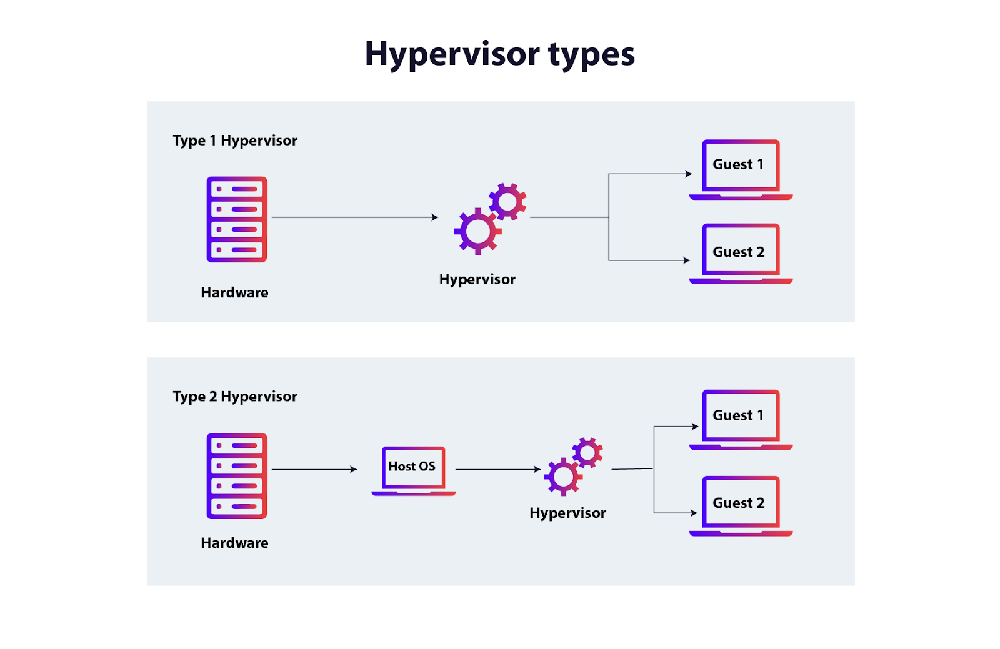
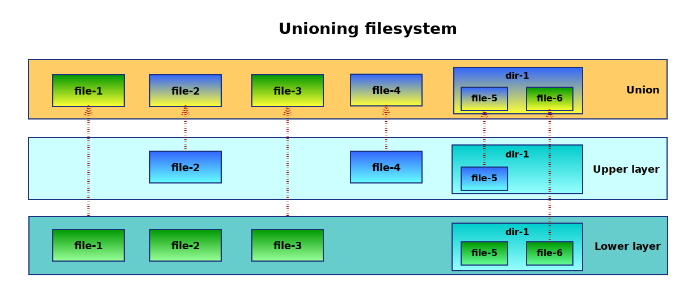

# Docker Daemon

## Docker architecture

:::{note}
`Docker` needs `WSL` or `Hyper-v` in order to work on `Windows`
:::

## Docker Daemon vs Virtual Environment

The main differences between `Docker Daemon` and
`Virtual environment`:

* `Virtual environment`:
    * Runs a full guest operating system
        * kernel
        * libraries
        * system files
    * Uses `VM hypervisor`
        * For example:
            * VMWare
            * Virtual box
            * Hyper-v
            * KVM
    * `VM hypervisor` virtualizes on the hardware
    * `VM`s run on a physical host
* `Container`:
    * Shares the host's operating system
    * Each container has an isolated **user space** but doesn't need
      separate user operating system.

## Different hypervisors

* Type 1 hypervisor
    * bare-metal
    * Runs directly on the underlying physical server
    * For example:
        * Hyper-v
        * Xen
* Type 2 hypervisor
    * hosted
    * Runs on top of an operating system
    * The operating system give them access to underlying physical server
    * `OS`
        * Controls hardware
    * `hypervisor`
        * Controls vms trough `OS`
    * For example:
        * VMWare
        * Virtual box

:::{note}
source of the image: https://www.appviewx.com/education-center/hypervisor/
:::

## Linux namespaces

<!--
https://harsh05.medium.com/understanding-namespaces-in-docker-0bbcf7697775

Namespaces provide a layer of isolation. 
Namespaces are a feature of Linux Kernel that partition kernel resources
in a way that one set of processes one set of resources while
another set of processes sees a different set of resources.

-->

A namespace wraps a global system resource in an abstraction that
makes it appear to the processes within the namespace that they
have their own isolated instance of the global resource.  Changes
to the global resource are visible to other processes that are
members of the namespace, but are invisible to other processes.
One use of namespaces is to implement `containers`.

We have different types of namespaces:

* `pid_namespaces` 
  * isolate the process ID number space.
* `network_namespaces`
  * provide isolation of the system resources associated with networking 
* `mount_namespaces` 
  * provide isolation of the list of mounts seen by the processes in each namespace instance 
* `uts_namespaces`
  * provide isolation of two system identifiers: the hostname and the NIS domain name 
  * UTS: UNIX Timesharing system
* `user_namespaces`
  * isolate security-related identifiers and attributes, in particular, user IDs and group IDs 

:::note
sources:
* https://man7.org/linux/man-pages/man7/namespaces.7.html
* https://man7.org/linux/man-pages/man7/pid_namespaces.7.html 
* https://man7.org/linux/man-pages/man7/network_namespaces.7.html
* https://man7.org/linux/man-pages/man7/mount_namespaces.7.html 
* https://man7.org/linux/man-pages/man7/uts_namespaces.7.html
* https://man7.org/linux/man-pages/man7/user_namespaces.7.html
* https://man7.org/linux/man-pages/man7/cgroup_namespaces.7.html 
* https://harsh05.medium.com/understanding-namespaces-in-docker-0bbcf7697775

:::

## Linux `cgroups`

Control groups, usually referred to as cgroups, are a Linux
kernel feature which allow processes to be organized into
hierarchical groups whose usage of various types of resources can
then be **limited** and **monitored**.

* `cgroup_namespaces`  
    * `unshare`

:::note
sources:
* https://man7.org/linux/man-pages/man7/cgroups.7.html 
* https://man7.org/linux/man-pages/man7/cgroup_namespaces.7.html 
* https://man7.org/linux/man-pages/man1/unshare.1.html 
:::

## Union file system

`Docker` uses `Union file system` like `OverlayFS` to manage container images.
This allows images to be built in layers.
When you run a container, you only run the necessary layers.

:::note
image srouce: https://wvi.cz/diyC/images-containers/ 
:::

